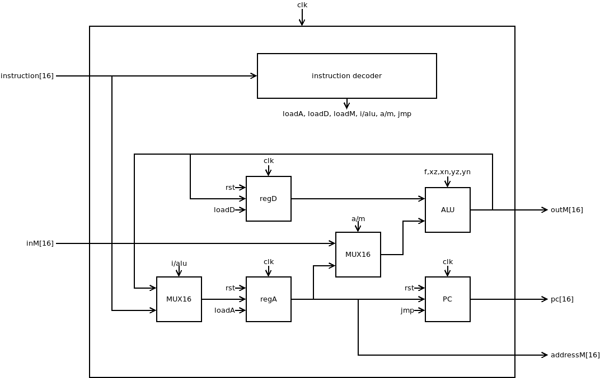

## Step 3 - CPU

As always, try:

```
make test
```

And make sure you see:

```
--- CPU PASS ---

--- ALL PASS ---
```

There is only a single file you need to implement in this section:

- CPU.v

### What is CPU?



The Hack CPU (Central Processing unit), consisting of an ALU, two registers named A and D, and a program counter named PC. The CPU is designed to fetch and execute instructions written in the Hack machine language. In particular, functions as follows: Executes the inputted instruction according to the Hack machine language specification. The D and A in the language specification refer to CPU-resident registers, while M refers to the external memory location addressed by A, i.e. to Memory[A]. The inM input holds the value of this location. If the current instruction needs to write a value to M, the value is placed in outM, the address of the target location is placed in the addressM output, and the writeM control bit is asserted. (When writeM==0, any value may appear in outM). The outM and writeM outputs are combinational: they are affected instantaneously by the execution of the current instruction. The addressM and pc outputs are clocked: although they are affected by the execution of the current instruction, they commit to their new values only in the next time step. If reset==1 then the CPU jumps to address 0 (i.e. pc is set to 0 in next time step) rather than to the address resulting from executing the current instruction.

----

**Congratulations**, let's move on to the last of our journey.